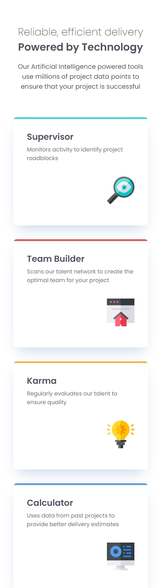
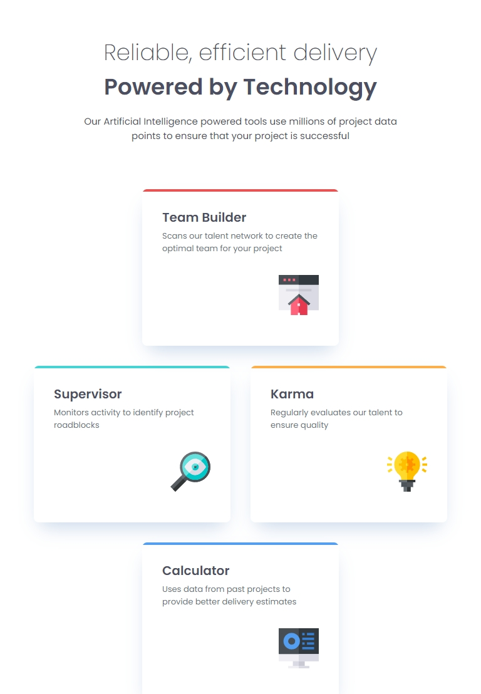
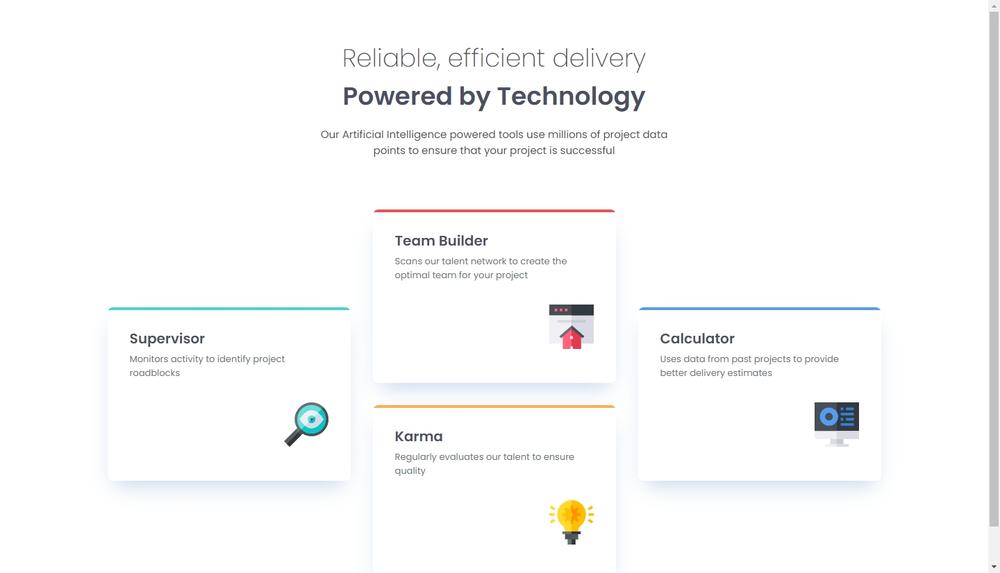

# Frontend Mentor - Four card feature section solution

This is a solution to the [Four card feature section challenge on Frontend Mentor](https://www.frontendmentor.io/challenges/four-card-feature-section-weK1eFYK). Frontend Mentor challenges help you improve your coding skills by building realistic projects.

## Table of contents

- [Overview](#overview)
  - [The challenge](#the-challenge)
  - [Screenshot](#screenshot)
  - [Links](#links)
- [My process](#my-process)
  - [Built with](#built-with)
  - [What I learned](#what-i-learned)
  - [Continued development](#continued-development)
  - [Useful resources](#useful-resources)
  - [AI Collaboration](#ai-collaboration)
- [Author](#author)
- [Acknowledgments](#acknowledgments)

## Overview

### The challenge

Users should be able to:

- View the optimal layout depending on their device's screen size

### Screenshot





### Links

- [Solution URL](https://www.frontendmentor.io/solutions/responsive-product-preview-with-hover-and-focus-states-bTnX7sITwn)
- [Live Site URL](https://freexm1nd.github.io/four-card-feature-section/)

## My process

### Built with

- Semantic HTML5 markup
- CSS custom properties
- Flexbox
- CSS Grid
- Mobile-first workflow

### What I learned

This challenge really tested my patience and my will! I had a really hard time figuring out how to best use grid to get the cards to sit the way I want them in all layouts. I eventually had to go back to the tutorial phase to get a refresher. I was determined to finish this one. The most challenging so far, but at the end equally the most satisfying. I learned to just keep going, even if it meant I had to step away for a bit.

Below is some code that reflects the things I learned above:

```html
<main>
  <section class="card-wrapper">
    <div class="card card--supervisor">
      <h2>Supervisor</h2>
      <p>Monitors activity to identify project roadblocks</p>
      
    </div>
    <div class="card card--team-builder">
      <h2>Team Builder</h2>
      <p>
        Scans our talent network to create the optimal team for your project
      </p>
      
    </div>
    <div class="card card--karma">
      <h2>Karma</h2>
      <p>Regularly evaluates our talent to ensure quality</p>
      
    </div>
    <div class="card card--calculator">
      <h2>Calculator</h2>
      <p>Uses data from past projects to provide better delivery estimates</p>
      
    </div>
  </section>
</main>
```

```css
@media screen and (min-width: 768px) {
  .title-wrapper {
    margin-bottom: 4.625rem;
  }

  .title-wrapper p:first-of-type,
  .title-wrapper h1 {
    font-size: var(--font-size-36);
  }

  .card-wrapper {
    display: grid;
    grid-template-columns: repeat(4, 1fr);
    grid-template-areas:
      ". a a ."
      "b b c c"
      ". d d .";
  }

  .card--team-builder {
    grid-area: a;
  }

  .card--supervisor {
    grid-area: b;
  }

  .card--karma {
    grid-area: c;
  }

  .card--calculator {
    grid-area: d;
  }
}

@media screen and (min-width: 1110px) {
  .card-wrapper {
    display: grid;
    grid-template-columns: repeat(3, 1fr);
    grid-template-areas:
      ". a ."
      "b a c"
      "b d c"
      ". d .";
    gap: var(--spacing-32);
  }

  .card {
    max-width: var(--card-width-desktop);
  }

  .card--team-builder {
    grid-area: a;
  }

  .card--supervisor {
    grid-area: b;
  }

  .card--calculator {
    grid-area: c;
  }

  .card--karma {
    grid-area: d;
  }
}
```

### Continued development

I want to continue figuring out was to use both flexbox and CSS Grid in tandem for more complicated layouts. I know that for this challenge I could've used flexbox for all layouts, but CSS Grid made the most logical sense to use in the tablet and desktop layouts. I definitely struggled to find out how to use CSS Grid properly at first. A lot of trial and error before being reminded of grid-areas.

### Useful resources

I continue to use Responsively to look at my designs on various screen sizes and to take screenshots.

- [Responsively App](https://responsively.app/)

David Cross and Kevin Powell both had videos around this specific challenge that I referenced to get the CSS Grids just right. It was a refresher for the grid-areas property specifically.

- [David Cross](https://youtu.be/8bY9kMqWw88?si=o-8_FIF5RoBnvIbc)
- [Kevin Powell](https://youtu.be/JFbxl_VmIx0?si=G-wmoCmggR-2JUy5)

### AI Collaboration

I used Claude in this challenge to assist in brainstorming solutions and to assist in debugging.

## Author

- GitHub - [Aaron Robbins](https://github.com/FREExM1ND)
- Frontend Mentor - [@FREExM1ND](https://www.frontendmentor.io/profile/FREExM1ND)

## Acknowledgments

A big thank you to David Cross and Kevin Powell for some great tutorials that ultimately helped me complete this challenge. Both creators are great and I highly recommend anyone use them as references and guides.

I'm thankful for the team at Responsively for creating a useful development tool. Thank you to Frontend Mentor for the challenge. I'm eager to do more.
